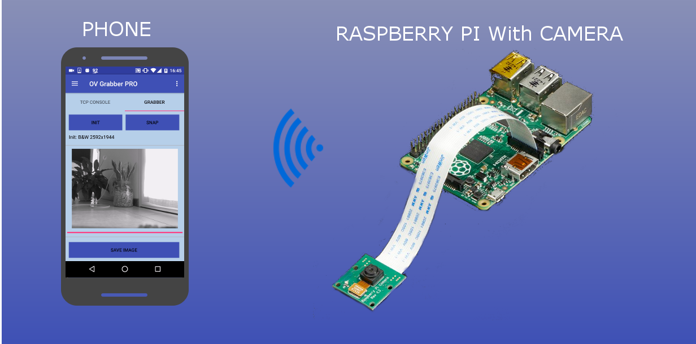

# Raspberry Pi with Camera

## What did you need?

Raspberry Pi with Camera

My Android App that you can download from Google Play here:
* [OV Grabber FREE](https://play.google.com/store/apps/details?id=com.edodm85.ovgrabber.free)
* [OV Grabber PRO](https://play.google.com/store/apps/details?id=com.edodm85.ovgrabber.paid)

## How does it work?

SOON

## License

> Copyright (C) 2018 edodm85.  
> Licensed under the MIT license.  
> (See the [LICENSE](https://github.com/edodm85/Raspberry_Pi_and_Camera_Board/blob/master/LICENSE) file for the whole license text.)
